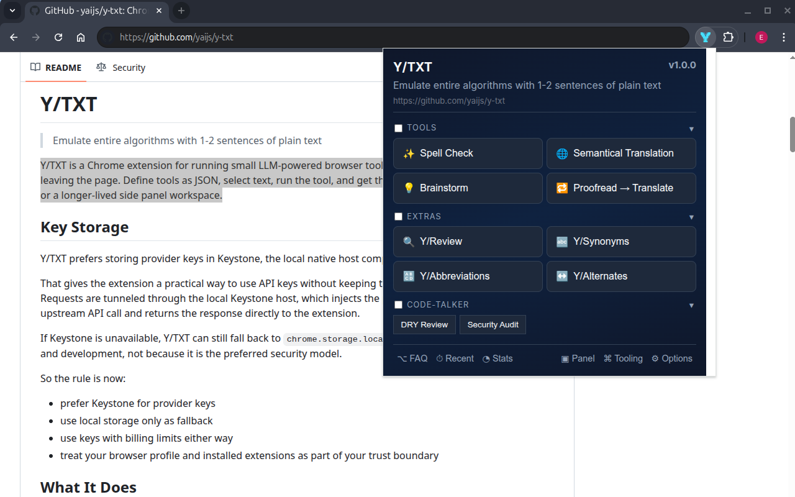
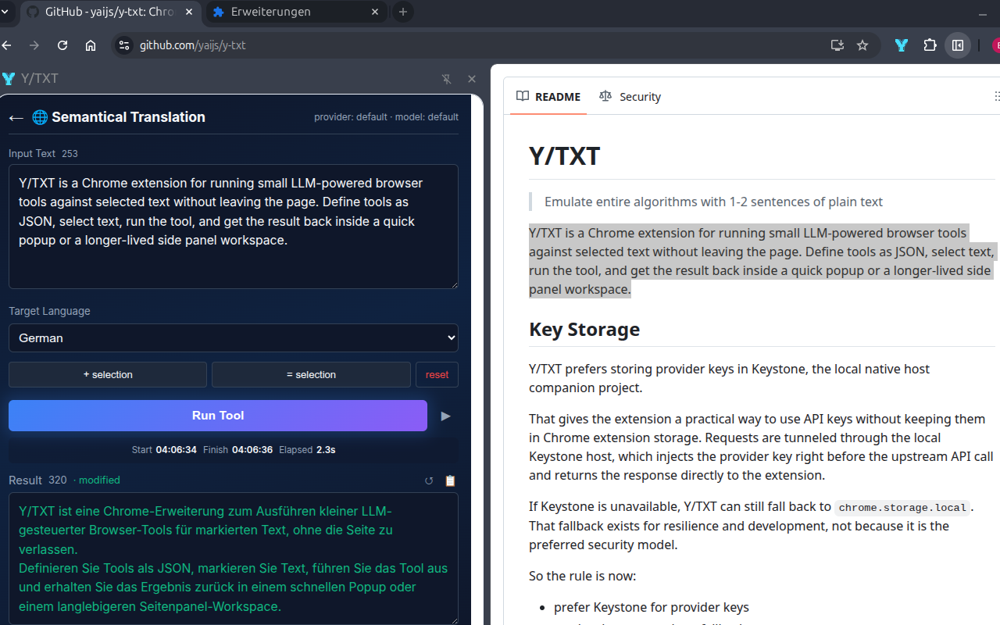
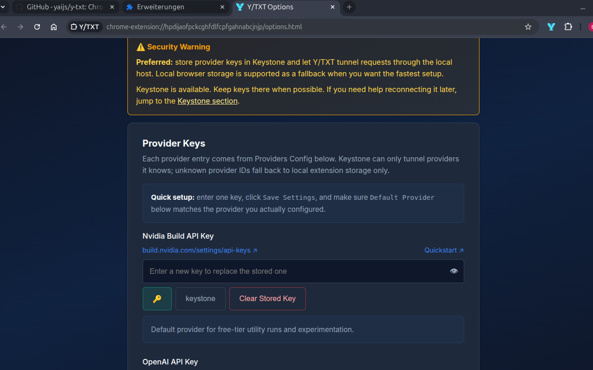

# Y/TXT

> Emulate entire algorithms
> with 1-2 sentences of plain text

Y/TXT is a Chrome extension for running small LLM-powered browser tools against selected text without leaving the page. Define tools as JSON, select text, run the tool, and get the result back inside a quick popup or a longer-lived side panel workspace.

## Screenshots

Popup index view:



Side panel translation workflow:



Options and provider setup:



## Key Storage

Y/TXT prefers storing provider keys in Keystone, the local native host companion project.

That gives the extension a practical way to use API keys without keeping them in Chrome extension storage. Requests are tunneled through the local Keystone host, which injects the provider key right before the upstream API call and returns the response directly to the extension.

If Keystone is unavailable, Y/TXT can still fall back to `chrome.storage.local`. That fallback exists for resilience and development, not because it is the preferred security model.

So the rule is now:

- prefer Keystone for provider keys
- use local storage only as fallback
- use keys with billing limits either way
- treat your browser profile and installed extensions as part of your trust boundary

## What It Does

- Runs prompt-defined tools against selected page text
- Supports Nvidia Build, OpenAI, DeepSeek, and Anthropic via provider adapters
- Lets you edit tools and model mappings live from the Options page
- Stores recent runs and restores an in-progress workspace
- Supports staged context for tools that need extra reference material
- Supports chained tools with multi-step pipelines
- Supports both a quick popup flow and a side panel workspace that share the same persisted state

## Current Workflow

1. Select text on a page.
2. Open the extension popup for a quick run, or open the side panel for a longer-lived workspace.
3. Pick a tool.
4. Review or edit the captured input.
5. Run the tool and copy the result, reuse it as the next input, or continue iterating.

The popup and side panel now share one persisted workspace. The side panel is better for longer sessions, staged context, and watching runs complete without losing the UI. The last 50 completed runs are stored in Recent.

## Provider Setup

Y/TXT needs at least one configured provider key plus the correct default provider before tools can run.

You have two supported storage paths:

- Keystone-backed secret storage
- local fallback keys in `chrome.storage.local`

Keystone is optional. It is the preferred storage path when available, but the extension can run entirely with locally stored provider keys.

## Install

There are two practical installation paths:

- build locally from source
- download a GitHub Release artifact and load it as an unpacked extension

Chrome-style browsers do not install this repo directly from GitHub. You need a folder containing the built extension files.

For the release artifact flow:

1. Download the latest `y-txt-...-extension.zip` release asset.
2. Unzip it somewhere local.
3. Open your browser's extensions page.
4. Enable `Developer mode`.
5. Click `Load unpacked`.
6. Select the unzipped extension directory.

You do not need to pick a specific file. The browser expects the whole extracted folder.

For local source builds:

```bash
npm install
npm run build
```

Then open the browser's extensions page, enable `Developer mode`, click `Load unpacked`, and select `dist/`.

## Permissions And Privacy

See also:

- [`PRIVACY.md`](./PRIVACY.md)
- [`SECURITY.md`](./SECURITY.md)

When Keystone is connected, provider keys are stored there instead of inside the extension.
If Keystone is unavailable, Y/TXT falls back to `chrome.storage.local`.

The extension now uses on-demand page access for selection capture:

- `activeTab`
- `storage`
- `scripting`

It no longer injects a content script into every page by default. Selection text is fetched only when you actively use the popup or side panel on the current tab.

You should still use keys with billing limits. Any extension that can read your browser storage is part of your trust boundary.

## Tool Format

Tools live in [`src/tools/tools.json`](./src/tools/tools.json). You can also edit the active tool config from the Options page without rebuilding.

## Quickstart: Add Your Own Tool

You do not need to understand JSON to extend Y/TXT.

1. Open the extension popup or side panel.
2. Click `⚙ Options`.
3. Scroll to `Tools Config`.
   The bundled defaults live in [`src/tools/tools.json`](./src/tools/tools.json), and the bundled model mappings live in [`src/models.json`](./src/models.json).
4. Copy the full JSON from that editor.
5. Open any chatbot you like: ChatGPT, Claude, DeepSeek, Gemini, Grok, or similar.
6. Ask for the tool you want, then paste your current `Tools Config` below your request.
7. Tell the chatbot to return the full updated JSON only.
8. Paste the response back into `Tools Config`.
9. Save it, reopen the popup or side panel, and use your new tool.

Useful prompt:

```text
I want a new Y/TXT tool for [describe the job].

Please update this existing Tools Config JSON.
Return valid JSON only.
Keep the existing structure and add the new tool to the most suitable category.
```

Minimal example:

```json
[
  {
    "id": "main",
    "label": "Tools",
    "tools": [
      {
        "id": "my-first-tool",
        "name": "Run VooDoo",
        "icon": "🪄",
        "systemPrompt": "You are a VooDoo priest. Do some magic with incoming input!",
        "userMessage": "Reverse the content, so only people who can read backwards can decipher it:\n\n{{input}}"
      }
    ]
  }
]
```

If the generated JSON does not save, the Options page now shows a validation error instead of silently breaking the extension.
You can also export your current tools/models as JSON files first, then re-import them later as backups.

Single-step tool:

```json
{
  "id": "spell_check",
  "name": "Spell Check",
  "icon": "✨",
  "systemPrompt": "You are an elite proofreader...",
  "userMessage": "Fix this text:\n\n{{input}}"
}
```

Chained tool:

```json
{
  "id": "proofread_translate",
  "name": "Proofread -> Translate",
  "steps": [
    {
      "id": "proofread",
      "name": "Proofread",
      "systemPrompt": "You are an elite proofreader...",
      "userMessage": "Fix this text:\n\n{{input}}"
    },
    {
      "id": "translated",
      "name": "Translate",
      "systemPrompt": "Translate to {{targetLanguage}}...",
      "userMessage": "Translate this:\n\n{{previous}}"
    }
  ]
}
```

### Supported Placeholders

- `{{input}}`: current step input
- `{{previous}}`: previous step output
- `{{originalInput}}`: original user input from the workspace
- `{{optionId}}`: any tool option value, such as `{{targetLanguage}}`
- `{{stepId}}`: output of a prior named step in the same chain

Option IDs and step IDs must be placeholder-safe identifiers such as `targetLanguage` or `first_step`.

## Model Sets

Model sets live in [`src/models.json`](./src/models.json). Tools can reference a tier such as `default`, `fast`, `coding`, or `creative`, and the background worker resolves that tier against the chosen provider for that tool step or the configured default provider.

Invalid model mappings are rejected in the Options page. Missing provider mappings now fail explicitly instead of silently falling back to some other provider entry.

## Providers

The current provider UI supports:

- Nvidia Build
- OpenAI
- DeepSeek
- Claude / Anthropic

OpenAI-compatible providers use the OpenAI SDK. Anthropic uses its own adapter against the Messages API.
Provider definitions now live in [`src/providers/providers.json`](./src/providers/providers.json), including labels, base URLs, adapter types, and provider defaults.

## Nvidia Build Quickstart

Y/TXT ships with Nvidia Build first in the default provider order because it is the easiest low-friction starting point.

Practical setup:

1. Create or sign in to your Nvidia Build account.
2. Create an API key at <https://build.nvidia.com/settings/api-keys>.
3. Open Y/TXT Options.
4. Paste the key into the Nvidia Build field.
5. Keep `Default Provider` set to `Nvidia Build`.
6. Save settings and start using the popup or side panel.

### Why Nvidia Build First?

As of March 31, 2026, Nvidia Build is the bundled default because it gives Y/TXT a low-friction free-tier starting point with a broad model catalog.

Why that matters for Y/TXT:

- many Y/TXT tools are short utility runs such as spell-checking, rewriting, translation, and summarization
- those jobs usually fit comfortably within the kinds of per-request limits common on Nvidia Build text models
- single-step Y/TXT tools use one model request per run, which keeps the workflow predictable
- the bundled defaults are chosen conservatively, but you can override providers and models at any time through plain JSON

Important caveat:

- actual rate limits, context sizes, and model availability vary by model and can change over time
- if you rely on a specific quota or context window, verify it against the current Nvidia Build model page before promising it operationally

## Development

```bash
npm install
npm run build
npm run typecheck
npm test
```

Load `dist/` as an unpacked extension from `chrome://extensions` after enabling `Developer mode`.

Keystone integration defaults to the `dev` native host (`com.ytxt.keystone.dev`) during local builds.
You can switch the build target with:

```bash
YTXT_KEYSTONE_FLAVOR=dev npm run build
YTXT_KEYSTONE_FLAVOR=beta npm run build
YTXT_KEYSTONE_FLAVOR=prod npm run build
```

The unpacked extension now includes a fixed manifest key, so its development ID is stable.
Current stable dev ID:

```text
hpdijaofpckcghfdlfcpfgahnabcjnjp
```

If you change to this build from an older unpacked ID, reinstall the Keystone native-host manifest with the new extension ID so `allowed_origins` matches.

The bundled provider order now puts Nvidia Build first, and that also makes it the default provider fallback in a fresh install unless a tool explicitly sets another provider.

## Notes

- The repo currently has no historical commit baseline yet; this started as a working-tree-first project.
- The tool and model editors are schema-validated now, but the quality of any given tool still depends on the prompt and the model behind it.
- Nvidia Build is the bundled default for cheap micro-tools, but provider behavior and model availability can still differ.

## The Bigger Picture

We have entered a new era of using computers.

For many string-based tasks such as correcting, translating, summarizing, reviewing, auditing, or brainstorming, the core "algorithm" is now often just a well-written instruction plus a capable model.

Consider a spell checker. Before LLMs, building one seriously meant dictionaries, language expertise, ranking logic, a product surface, backend infrastructure, policy work, and ongoing maintenance. That is not a tiny utility. That is a full product category.

Now compare that to this:

> You are an elite proofreader. Fix spelling, grammar, and punctuation. Maintain the exact original formatting. Output only the corrected text.

That is already a usable spell-check tool.

The same compression happens again and again:

- translation
- tone shifting
- synonyms
- abbreviations
- alternates
- review
- code review
- security audit
- brainstorming
- chained prompt workflows

The default Y/TXT setup now ships with 10 tools, and most of them are only a few lines of JSON. In practice, that replaces a surprising amount of standalone software, browser tabs, prompt repetition, and in some cases entire paid subscriptions for narrow text workflows.

That is the real point of the project. It is not just "an extension with prompts". It is a small proof that text has become executable.

What used to require dedicated libraries, custom logic, service layers, and specialized UX can now often be expressed as:

- a tool name
- a system prompt
- a user message template
- maybe a dropdown or two

That shift is easy to underestimate, but it is substantial. A couple hundred lines of configuration can now stand in for an absurd amount of historical software surface area.

This project was built in exactly that spirit. The tool idea, the tool implementation, and much of the extension itself came out of conversations with language models. The spell checker example is not just what Y/TXT does. It is also how Y/TXT got built.

What once required a company can now start with a conversation.
